# License Plate Auction Platform

A backend-focused full-stack application for managing and participating in online license plate auctions.

The project is built with Spring Boot, MongoDB, and Redis. It focuses on backend concerns commonly found in
transactional systems, including authentication, authorization, concurrent bidding, wallet balance management, rate
limiting, caching, real-time updates, and environment-based deployment.

This repository is primarily a personal engineering project used to study and implement backend architecture beyond
standard CRUD operations.

## Live Deployment

Backend API:

```text
https://licenseplateauctions-production.up.railway.app
```

Health check:

```text
GET https://licenseplateauctions-production.up.railway.app/api/v1/health
```

Source code:

```text
https://github.com/sang-dev-fstck/license_plate_auctions
```

The public deployment is intended for demonstration and portfolio purposes. It should not be treated as a production
financial or auction service.

## Engineering Highlights

The backend currently includes:

- Redis-backed opaque-token authentication using secure HttpOnly cookies.
- Stateless Spring Security request authentication.
- CSRF protection for cookie-authenticated browser requests.
- Immediate current-session and all-session revocation.
- Conditional atomic updates and optimistic concurrency control for bidding.
- Bounded retries for concurrent bid conflicts.
- Compensating wallet operations for multi-document bid workflows.
- Fixed-window login rate limiting using Redis.
- Sliding-window bid rate limiting using Redis sorted sets.
- Atomic Redis rate-limit operations implemented with Lua scripts.
- Redis read caching for auction session detail and bid history.
- Cache stampede protection using a distributed Redis lock.
- Server-Sent Events for real-time auction updates.
- Dynamic customer search using MongoTemplate and dedicated read models.
- Docker-based deployment with environment-specific configuration.

## System Architecture

```mermaid
flowchart LR
    Client[React Client]

    Client -->|REST API| API[Spring Boot API]
    Client <-->|SSE Stream| API

    API --> Security[Spring Security]
    Security --> RedisAuth[(Redis Auth Sessions)]

    API --> RateLimit[Redis Rate Limiting]
    RateLimit --> Redis[(Redis)]

    API --> Cache[Redis Read Cache]
    Cache --> Redis

    API --> Mongo[(MongoDB)]

    API --> Realtime[SSE Event Publisher]
    Realtime --> Client
```



The application is currently deployed as a single Spring Boot instance.

Authentication state, rate-limit counters, cache entries, and distributed cache locks are stored in Redis. Auction,
wallet, participation, and bid data are stored in MongoDB.

## Core Backend Capabilities

### Authentication and Session Management

The application uses custom opaque-token authentication rather than exposing identity or authorization data directly in
the client token.

Authentication flow:

1. A user submits valid credentials.
2. The backend generates a cryptographically random opaque token.
3. Only a hash of the token and its associated session data are stored in Redis.
4. The raw token is returned through a secure HttpOnly cookie.
5. Each protected request passes through a custom Spring Security filter.
6. The filter hashes the received token, resolves the Redis session, and reconstructs the authenticated security
   context.

This design supports:

- Server-side session expiration.
- Immediate current-session revocation.
- Immediate revocation of all sessions belonging to an account.
- No sensitive user information stored inside the client token.
- Stateless Spring Security processing at the application layer.

### CSRF Protection

Because authentication is cookie-based, unsafe browser requests are protected using Spring Security CSRF protection.

The frontend obtains a CSRF token from:

```text
GET /api/v1/auth/csrf
```

The token must then be submitted through:

```text
X-XSRF-TOKEN
```

The CSRF cookie and authentication cookie are configured through environment variables so that local and cross-origin
deployments can use appropriate `Secure` and `SameSite` policies.

### Concurrent Bidding

A bid request may be processed at the same time as bids from other users. A simple read-modify-save flow could therefore
accept a bid based on stale auction data.

The bidding flow protects the `AuctionSession` state using a conditional atomic update:

```text
expected session ID
+ expected version
+ required business state
-> update current price, leader, end time, and version
```

If another request changes the session first, the update matches no document and is translated into an optimistic
locking conflict.

The service retries the complete bid operation a bounded number of times so that every retry:

- Reloads the latest session state.
- Revalidates the bid amount.
- Revalidates the session status and auction time.
- Attempts the state transition against the new version.

This is effectively an atomic compare-and-set operation implementing optimistic concurrency control.

### Wallet and Participation Consistency

A successful bid may modify several MongoDB documents:

- Wallet.
- Auction participation.
- Auction session.
- Bid history.
- Previous leader wallet.

The current implementation does not claim that the complete multi-document workflow is one atomic database transaction.

Instead, it combines:

- Conditional wallet balance updates.
- Optimistic locking on mutable entities.
- Atomic session state transitions.
- Bounded retries.
- Compensating operations when a later step fails.
- Post-operation consistency checks and structured error logging.

This design was chosen as a practical learning implementation. A production financial system would require stronger
guarantees, idempotency, reconciliation jobs, and comprehensive failure testing.

### Rate Limiting

Two rate-limiting strategies are implemented.

#### Login Rate Limiting

Login attempts are restricted using a fixed-window counter based on request dimensions such as IP address and normalized
account identifier.

Redis Lua scripts execute counter increment and TTL assignment atomically.

#### Bid Rate Limiting

Bid attempts use a sliding-window algorithm backed by a Redis sorted set.

Each attempt is stored using:

```text
score  = request timestamp
member = timestamp + unique request identifier
```

A Lua script atomically:

1. Removes expired entries.
2. Counts active entries in the current window.
3. Rejects the request when the configured limit is reached.
4. Inserts the new attempt.
5. Refreshes the key expiration.

This provides more accurate enforcement around window boundaries than a basic fixed-window counter.

### Redis Caching

Frequently requested auction data is cached in Redis, including:

- Auction session detail.
- Bid history.

Write operations explicitly invalidate related cache entries after the authoritative MongoDB state has changed.

Cache invalidation is centralized in a dedicated cache service instead of being spread across multiple business methods
through annotations.

### Cache Stampede Protection

When a hot cache entry expires, many requests may attempt to reload the same data from MongoDB at the same time.

The session detail read path uses:

- Redis `SET NX` lock acquisition.
- A bounded lock TTL.
- Double-checked cache lookup.
- Short polling for requests that did not acquire the lock.
- Lua compare-and-delete unlock to prevent one process from deleting another process's lock.

The lock protects database efficiency rather than business correctness. MongoDB conditional updates remain responsible
for auction correctness.

### Real-Time Auction Updates

Server-Sent Events are used for one-way real-time communication from the backend to connected clients.

Published events may include:

- Accepted bids.
- Current price changes.
- Current leader changes.
- Auction end-time extensions.
- Session status changes.

SSE was selected because the current client primarily needs server-to-client updates rather than full bidirectional
communication.

The current emitter registry is designed for a single application instance. A multi-instance deployment would require a
shared event transport such as Redis Pub/Sub, Redis Streams, or another message broker.

### Dynamic Search and Read Models

Customer-facing auction searches use MongoTemplate for dynamic query construction.

Supported query concerns include:

- Auction status.
- Date range.
- Normalized license plate number.
- Pagination.
- Whitelisted sorting fields.

Dedicated read models are used so customer search queries do not expose or load the complete domain entity when only a
subset of fields is required.

## Technology Stack

### Backend

- Java 21
- Spring Boot 3.4.3
- Spring Security
- Spring Data MongoDB
- MongoTemplate
- Spring Data Redis
- Server-Sent Events
- MapStruct
- Jackson
- Lombok
- Maven

### Data and Infrastructure

- MongoDB
- Redis
- MongoDB Atlas
- Upstash Redis
- Docker
- Railway

### Frontend

- React
- TypeScript
- Redux Toolkit Query
- Ant Design
- Vite

## Project Structure

The backend follows a layered structure with dedicated components for domain-specific and infrastructure-specific
concerns.

```text
src/main/java/com/auction/backend
├── config
├── controller
├── dto
├── entity
├── enums
├── exception
├── mapper
├── repository
├── security
│   ├── filter
│   ├── ratelimit
│   └── session
├── service
└── scheduler
```

General responsibilities:

| Package      | Responsibility                                                         |
|--------------|------------------------------------------------------------------------|
| `controller` | HTTP request handling and response mapping                             |
| `service`    | Business workflows and domain coordination                             |
| `repository` | MongoDB and Redis persistence operations                               |
| `entity`     | Persistent MongoDB domain models                                       |
| `dto`        | API request, response, and read-model contracts                        |
| `mapper`     | Mapping between entities and DTOs                                      |
| `security`   | Authentication, CSRF integration, filters, sessions, and rate limiting |
| `config`     | Spring, Redis, MongoDB, CORS, cookie, and application configuration    |
| `scheduler`  | Time-based auction lifecycle processing                                |
| `exception`  | Business exceptions and centralized API error handling                 |

## Main Domain Areas

The backend currently covers the following domains:

- Account registration and authentication.
- Wallet and frozen-balance management.
- License plate and category management.
- Auction session search and lifecycle.
- Auction participation and deposits.
- Bid placement and bid history.
- Session revocation.
- Realtime auction updates.
- Administrative configuration.

## Configuration

Application configuration is loaded through environment variables. Secrets must not be committed to source control.

### Required Environment Variables

| Variable                 | Description                                                  |
|--------------------------|--------------------------------------------------------------|
| `SPRING_PROFILES_ACTIVE` | Active Spring profile                                        |
| `MONGODB_URI`            | MongoDB connection string                                    |
| `REDIS_URL`              | Redis connection URL                                         |
| `CORS_ALLOWED_ORIGINS`   | Comma-separated allowed frontend origins                     |
| `AUTH_COOKIE_SECURE`     | Enables the `Secure` attribute for the authentication cookie |
| `AUTH_COOKIE_SAME_SITE`  | Authentication cookie `SameSite` policy                      |
| `CSRF_COOKIE_SECURE`     | Enables the `Secure` attribute for the CSRF cookie           |
| `CSRF_COOKIE_SAME_SITE`  | CSRF cookie `SameSite` policy                                |
| `CSRF_ENABLED`           | Enables or disables CSRF protection                          |
| `PORT`                   | HTTP port supplied by the hosting platform                   |

### Example Local Environment

Create a local `.env` file that is excluded from Git:

```env
SPRING_PROFILES_ACTIVE=prod

MONGODB_URI=mongodb://localhost:27017/auction_system_db
REDIS_URL=redis://localhost:6379

CORS_ALLOWED_ORIGINS=http://localhost:5173

AUTH_COOKIE_SECURE=false
AUTH_COOKIE_SAME_SITE=Lax

CSRF_COOKIE_SECURE=false
CSRF_COOKIE_SAME_SITE=Lax

CSRF_ENABLED=true
```

For a frontend and backend hosted on different HTTPS sites, browser cookie policies may require:

```env
AUTH_COOKIE_SECURE=true
AUTH_COOKIE_SAME_SITE=None

CSRF_COOKIE_SECURE=true
CSRF_COOKIE_SAME_SITE=None
```

`SameSite=None` cookies must also use `Secure=true`.

## Running Locally

### Prerequisites

- JDK 21
- Docker
- Git

### 1. Clone the Repository

```bash
git clone https://github.com/sang-dev-fstck/license_plate_auctions.git
cd license_plate_auctions
```

Run the following commands from the directory containing the backend Maven wrapper.

### 2. Start MongoDB

```bash
docker run \
  --name auction-mongodb \
  -p 27017:27017 \
  -d mongo:7
```

### 3. Start Redis

```bash
docker run \
  --name auction-redis \
  -p 6379:6379 \
  -d redis:7-alpine
```

### 4. Configure Environment Variables

Either export the required variables in the current terminal or load them from a local `.env` file.

Example:

```bash
export SPRING_PROFILES_ACTIVE=prod
export MONGODB_URI=mongodb://localhost:27017/auction_system_db
export REDIS_URL=redis://localhost:6379
export CORS_ALLOWED_ORIGINS=http://localhost:5173
export AUTH_COOKIE_SECURE=false
export AUTH_COOKIE_SAME_SITE=Lax
export CSRF_COOKIE_SECURE=false
export CSRF_COOKIE_SAME_SITE=Lax
export CSRF_ENABLED=true
```

### 5. Run the Backend

```bash
./mvnw spring-boot:run
```

The application starts at:

```text
http://localhost:8080
```

Health check:

```bash
curl http://localhost:8080/api/v1/health
```

## Running with Docker

Build the image:

```bash
docker build -t license-plate-auction-backend .
```

Run the container:

```bash
docker run \
  --name license-plate-auction-backend \
  --env-file .env \
  -p 8080:8080 \
  license-plate-auction-backend
```

## Building the Application

```bash
./mvnw clean package
```

The executable JAR is generated under:

```text
target/
```

## Authentication and CSRF Client Flow

For browser-based clients:

1. Call the CSRF endpoint with credentials enabled.

```http
GET /api/v1/auth/csrf
```

2. Store the token returned in the response body.

3. Include cookies on subsequent requests.

```javascript
credentials: "include"
```

4. Send the CSRF value in the following header for unsafe HTTP methods:

```http
X-XSRF-TOKEN: <csrf-token>
```

5. After login, refresh the CSRF token before the next protected write request because Spring Security may rotate the
   token after authentication.

The authentication cookie is HttpOnly and must not be read directly by frontend JavaScript.

## Deployment

The backend is containerized through a multi-stage Docker build and deployed on Railway.

Managed infrastructure:

- MongoDB Atlas for persistent application data.
- Upstash Redis for authentication sessions, caching, locks, and rate limiting.
- Railway for container execution and public HTTPS routing.

Production configuration is provided entirely through environment variables.

No database password, Redis credential, cookie secret, or deployment-specific secret should be committed to the
repository.

## Design Decisions

| Concern             | Current Decision                             | Reason                                                                            |
|---------------------|----------------------------------------------|-----------------------------------------------------------------------------------|
| Authentication      | Redis-backed opaque token                    | Supports immediate revocation and keeps authentication data server-side           |
| Authorization       | Spring Security                              | Centralized route and role enforcement                                            |
| CSRF                | Cookie-based CSRF token                      | Required for browser requests using cookie authentication                         |
| Bid concurrency     | Conditional atomic update with version check | Prevents stale writes and lost updates                                            |
| Conflict handling   | Bounded retry                                | Reloads and revalidates state without unlimited retry loops                       |
| Rate limiting       | Redis Lua scripts                            | Executes multi-step rate-limit logic atomically                                   |
| Read caching        | Redis                                        | Reduces repeated MongoDB access for frequently requested data                     |
| Stampede protection | Redis distributed lock                       | Prevents concurrent cache misses from overloading MongoDB                         |
| Real-time updates   | SSE                                          | Appropriate for server-to-client auction events                                   |
| Search              | MongoTemplate and read models                | Supports dynamic filtering and response-focused queries                           |
| Deployment model    | Single Spring Boot service                   | Keeps deployment and domain coordination manageable for the current project scope |

## Current Limitations

The current implementation intentionally has a limited production scope.

- The public deployment currently runs as a single application instance.
- SSE event delivery is local to the running application instance.
- Scheduler execution has not yet been coordinated across multiple instances.
- The complete bid workflow spans multiple MongoDB documents and is not one atomic database transaction.
- Compensating operations can also fail and would require reconciliation in a production financial system.
- Capacity has not yet been established through a formal load-testing report.
- Comprehensive automated integration, concurrency, and failure-injection test coverage is still being expanded.
- The system does not currently claim multi-region availability or zero-downtime failover.

## Planned Improvements

The next technically meaningful improvements are:

- Add unit, integration, and concurrent bid tests.
- Add k6 load tests and document p50, p95, p99, throughput, and error rates.
- Add metrics for bid conflicts, Redis latency, MongoDB latency, and active SSE connections.
- Add idempotency keys for critical write requests.
- Introduce reconciliation jobs for wallet and participation inconsistencies.
- Use Redis Pub/Sub or Redis Streams for multi-instance SSE event distribution.
- Add distributed coordination for scheduled auction lifecycle jobs.
- Validate horizontal scaling with multiple application instances behind a load balancer.

Microservices, Kafka, Kubernetes, and multi-region infrastructure are not current project requirements. They should only
be introduced when an identified scaling, deployment, or domain-boundary problem justifies their operational cost.

## Project Status

The core backend and frontend auction flows have been implemented and publicly deployed.

The project remains under active development as a backend engineering sandbox, with further work focused on testing,
observability, performance measurement, and multi-instance readiness rather than adding unrelated technologies.

## Author

Sang Ho Ngoc

GitHub:

```text
https://github.com/sang-dev-fstck
```